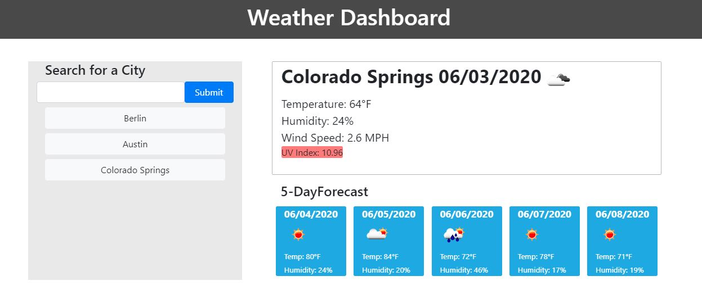

# WeatherAPI
This is a WeatherAPI project

It uses ajax requests to get weather information from openweathermap.com. 

Two different API's are used to get the information. First one is to get searched city information,
and second one is five day forecast of the searched city.

It uses moment.js so that the dates are correct with each search.

This project has taught me how to request information from the internet and manipulate that data to display to the users.

